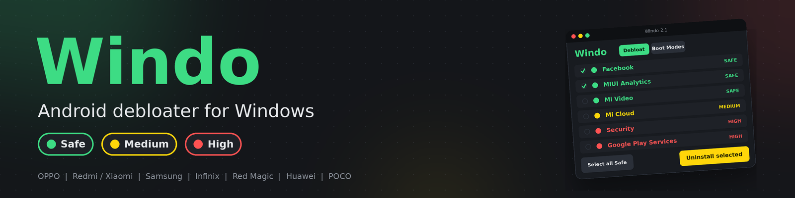

🧹 Windo
⚡ Android Debloater for Windows

🛡️ Clean your Android. Know the risk before you remove anything.

🌈 What is Windo?

🧹 Windo is a Windows tool for removing unwanted Android apps and bloatware.

🔍 See what an app does.
🚦 Check its risk level.
🗑️ Remove it when you're ready.
♻️ Restore it if you change your mind.

✨ Features
🎯 Feature	💡 Description
📱 Device Detection	🔵 Brand, model, Android version, battery & screen
🚦 Risk Levels	🟢 Safe · 🟡 Medium · 🔴 High
🔍 App Details	📖 Understand apps before removing them
📦 880+ Apps	🎮 Built-in database of known apps & games
🤖 Smart Detection	🧠 Unknown packages marked as GUESS
♻️ Restore Mode	🔄 Restore supported removed apps
🛠️ Boot Modes	🔧 Recovery · ⚡ Fastboot · 📥 Download
📱 Supported Brands

🟣 OPPO
🔴 Xiaomi
🟠 Redmi
🟡 POCO
🔵 Samsung
🟢 Infinix
🔷 Red Magic
🟪 Huawei

🪟 Windows Support
🖥️ Version	📊 Status
🪟 Windows 11	🟢 Supported
🪟 Windows 10	🟢 Supported
🪟 Windows 8.1 / 8	🟡 Should work
🪟 Windows 7 SP1	🟡 Should work
💻 Vista / XP	🔴 Not supported
🚀 Installation
📥 1. Download

Download Windo.exe and place it in a folder:

📁 C:\Windo\
└── 🧹 Windo.exe

🔧 2. Install Platform-Tools

You need Google's ADB & Fastboot tools:

📁 C:\Windo\
├── 🧹 Windo.exe
└── 📁 platform-tools\
    ├── 🔌 adb.exe
    └── ⚡ fastboot.exe

📱 3. Enable USB Debugging

On your phone:

⚙️ Settings → 📱 About phone → 🔢 Build number → Tap 7×

Then:

⚙️ Developer options → 🔌 USB debugging → ON

🔗 Connect your phone.

✅ Press Allow when the USB debugging message appears.

🎉 4. Start Windo

▶️ Open Windo.exe

🔄 Press Refresh Devices

📱 Select your device.

🚦 Risk System
🟢 SAFE

Usually safe to remove.

🟡 MEDIUM

May disable a feature or service.

🔴 HIGH

Can break important phone functionality.

💡 Always read the app information before uninstalling.

🧹 Remove Apps

🔍 Select App
↓
📖 Read Description
↓
🚦 Check Risk
↓
🗑️ Uninstall

🟢 New to debloating? Start with Safe apps.

♻️ Restore

Changed your mind?

🔄 Open Restore Removed and restore supported apps.

🛠️ Boot Modes

🔧 Recovery Mode
⚡ Fastboot Mode
📥 Samsung Download Mode

🛡️ Windo only reboots your device.

🚫 No flashing
🚫 No bootloader unlocking
🚫 No factory reset

🆘 Troubleshooting
😵 Problem	🔧 Fix
📵 Unauthorized / Offline	🔓 Unlock → revoke USB debugging → reconnect
🔌 Device not detected	🔗 Try another cable or USB port
❌ adb not found	📁 Check platform-tools
📋 App list empty	👀 Enable Show other/unknown apps
🛡️ Antivirus warning	📥 Download only from the official release
🛡️ Safety First

🟢 Start with Safe apps

🔴 Avoid critical packages

Examples:

⚙️ System UI

📞 Phone Services

▶️ Google Play Services

💾 Back up your important data

🔐 Move your 2FA codes before removing authenticator apps

⚠️ You are responsible for what you remove.

🌟 Why Windo?

🧹 Clean — Remove unwanted bloatware
🚦 Transparent — Know the risk first
🤖 Smart — Detect known & unknown packages
♻️ Recoverable — Restore supported apps
🛡️ Safer — Designed to prevent blind removal

💙 Windo
🧹 Clean Android
🚦 Know the Risk
🛡️ Remove Smarter

⭐ If Windo helps you, consider starring the repository!

